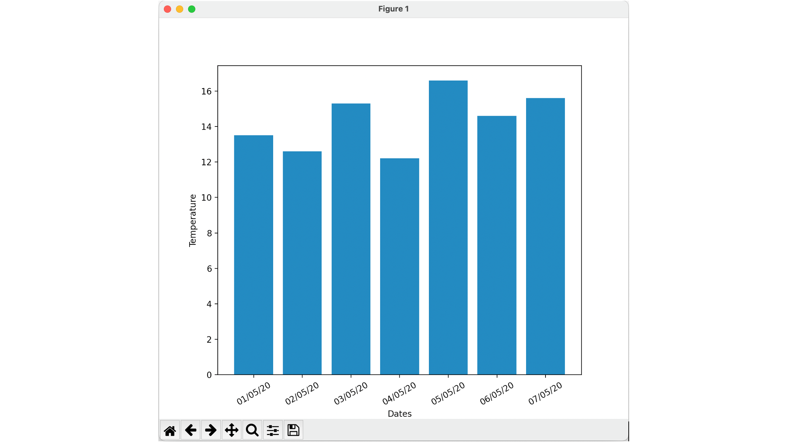

# Lab 14: MatPlotLib 

In this lab, we will add graphing behavior to our program. 

The aim is to graph the data held in the `data.csv` file as shown below:
.



This is a simple bar chart graph illustrating the temperature readings for each of the days listed in London.

The lab is comprised of the following steps:
1. Add MatPlotLib to your environment
2. Import the library
3. Obtain the data to display
4. Graph the data
5. Run the application

## Step 1: Add MatPlotLib to Your Environment

First, we need to add `matplotlib` to your Python environment. This can be done through the Preferences menu in PyCharm. Make sure you select the `Project > Python Interpreter` node in the left-hand tree.

Use the ‘+’ option to add the `matplotlib` library to your project configuration.

Or from the terminal, you can use pip and run 

```
pip install matplotlib
```

## Step 2: Import the Library

Next, we need to import the `pyplot` API from the `matplotlib` library. Add the following import statement at the start of your program:

```python
import matplotlib.pyplot as pyplot
```

## Step 3: Obtain the Data to Display

Once we have done this, we can proceed to graph the data loaded from the file.

If you don't already have the temperatures and dates extracted from the `TemperatureReading` objects, you will need to extract these, for example:

```python
# Obtain just the temperatures, dates, and the indexes for each value
temperatures = list(map(lambda r: r.value, readings))
print('Temperatures:', temperatures)
dates = list(map(lambda r: r.date, readings))
print('Dates:', dates)
```

## Step 4: Graph the Data

Next, we need to configure the chart and display it:

```python
# Generate a range for the indexes of the bar chart
index = range(len(readings))

# Set up the bar chart
pyplot.bar(index, temperatures, tick_label=dates)
pyplot.xticks(rotation=75)
pyplot.ylabel('Temperature')
pyplot.xlabel('Dates')

# Display the chart
pyplot.show()
```

## Step 5: Run the Application

Now, run the application and see the output generated.

---
